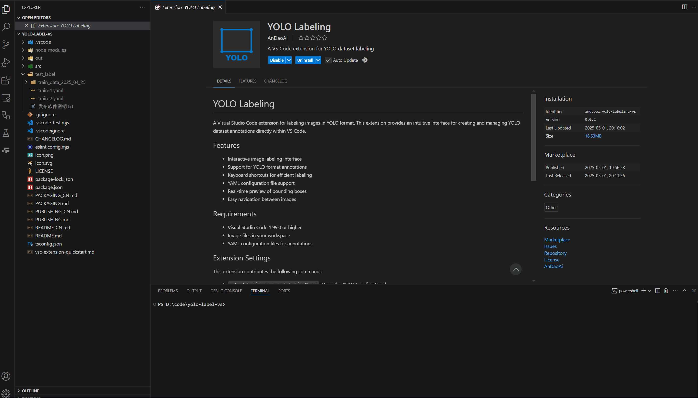
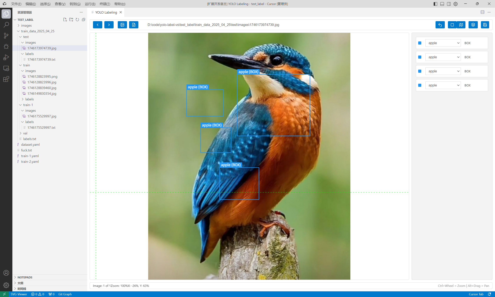
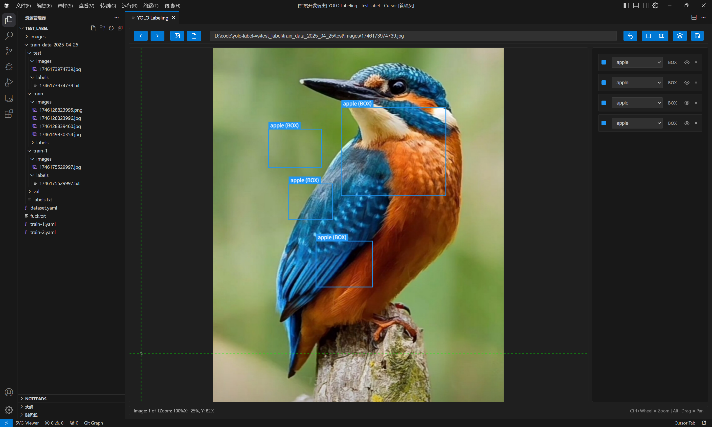
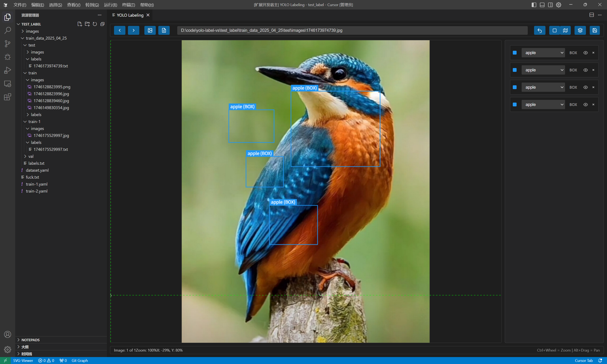
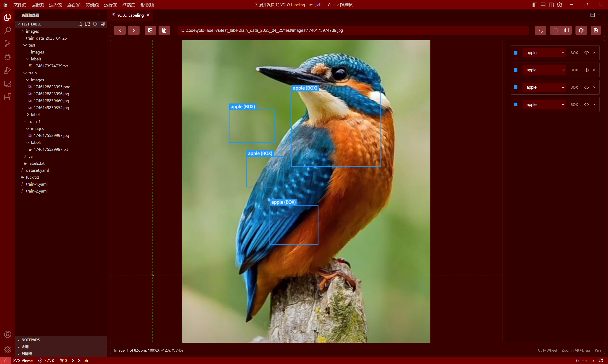
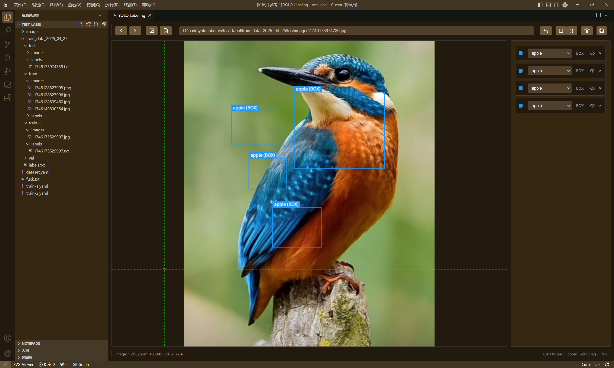

# YOLO 标注工具

一个专门用于快速浏览和编辑 YOLO 数据集标注的 VS Code 扩展。通过 YAML 配置文件，您可以直接在 VS Code 中高效地查看和修改 YOLO 格式的标注数据，让数据集管理变得轻松简单。

## 演示

## 主题支持

我们的扩展无缝集成了所有 VS Code 主题，提供一致的用户体验：

  
  
  
  
  
  

## 相关文档

- 中文文档
  - [打包指南](./PACKAGING_CN.md)
  - [发布指南](./PUBLISHING_CN.md)
- English Documentation
  - [Packaging Guide](./PACKAGING.md)
  - [Publishing Guide](./PUBLISHING.md)
  - [README in English](../README.md)

## 核心功能

- **快速数据集浏览**：通过 YAML 配置文件即时查看 YOLO 标注的图像
- **高效标签管理**：在 VS Code 中直接修改已有标注
- **直观预览**：实时可视化边界框和标签
- **流畅导航**：使用快捷键快速切换图片
- **YAML 集成**：直接支持 YAML 配置文件
- **批量处理**：连续浏览和编辑多个图像

## 为什么选择本扩展？

- **简化工作流程**：无需在不同工具间切换 - 直接在 VS Code 中查看和编辑 YOLO 数据集
- **开发者友好**：完美适配需要快速验证或调整 YOLO 数据集的机器学习工程师
- **轻量级设计**：快速响应，专为处理大型数据集而设计
- **集成体验**：无缝融入您的开发环境

## 系统要求

- Visual Studio Code 1.85.0 或更高版本
- 工作区中的图片文件
- 用于 YOLO 标注的 YAML 配置文件

## 安装方法

1. 打开 VS Code
2. 按下 `Ctrl+P` 打开快速打开对话框
3. 输入 `ext install andaoai.yolo-labeling-vs`
4. 按回车键安装

或者您可以直接从 [VS Code 插件市场](https://marketplace.visualstudio.com/items?itemName=andaoai.yolo-labeling-vs) 安装。

## 使用方法

1. 打开包含 YAML 配置文件和对应图片的文件夹
2. 在资源管理器中右键点击 YAML 文件
3. 选择 "打开 YOLO 标注面板"
4. 浏览已标注的图片并根据需要进行调整

### 界面控件

- **上一张/下一张图片**：在数据集中导航浏览图片
- **模式选择器**：在边界框(Box)和分割(Segmentation)标注模式之间切换
- **显示标签**：切换图像上标签的可见性
- **保存标签**：将当前标注保存到磁盘
- **搜索框**：在数据集中搜索特定图片

### 快捷键

#### 全局快捷键
- `Ctrl+Y`: 打开 YOLO 标注面板

#### 标注面板内快捷键
- `D`: 下一张图片
- `A`: 上一张图片
- `Ctrl+S`: 保存标签
- `Ctrl+Z`: 撤销上一个标注操作
- `Ctrl+滚轮`: 以鼠标位置为中心放大/缩小
- `Alt+拖动`: 放大时平移图像
- `滚轮`: 放大时垂直滚动
- `Shift+滚轮`: 放大时水平滚动
- `右键点击`: 取消多边形绘制（在分割模式下）

#### 搜索功能
- `向下箭头`: 在搜索结果中向下移动
- `向上箭头`: 在搜索结果中向上移动
- `回车`: 选择高亮的搜索结果
- `Esc`: 关闭搜索结果面板

## 扩展设置

此扩展提供以下命令：

* `yolo-labeling-vs.openLabelingPanel`: 打开 YOLO 标注面板

## 已知问题

如果您发现任何问题，请在我们的 [GitHub 仓库](https://github.com/andaoai/yolo-label-vs/issues) 上报告。

## 版本说明

### 0.0.6

- 添加了无缝的 VSCode 主题集成和正确的按钮样式
- 添加了主题展示，支持多种 VSCode 主题
- 改进了所有主题变体下的 UI 响应性
- 修复了按钮样式问题，使其正确跟随 VSCode 主题变化
- 增强了浅色和深色主题下的视觉一致性

### 0.0.5

- 移除了重做功能按钮，解决与 Ctrl+Y 快捷键的冲突
- 改进了 YAML 图像路径加载失败时的错误处理
  - 添加了错误跟踪和恢复机制
  - 实现了资源的正确清理
  - 在错误页面添加了重新加载按钮
  - 增强了错误消息，提供故障排除指导
- 为所有工具栏按钮添加了显示键盘快捷键的工具提示
- 添加了更好的错误消息和恢复选项

### 0.0.4

- 简化了键盘快捷键，提高了易用性
- 将主快捷键从 `Ctrl+Shift+Y` 改为 `Ctrl+Y`，更容易使用
- 移除了 `Ctrl+Right` 和 `Ctrl+Left` 快捷键
- 优化了界面，隐藏了标签列表的滚动条
- 通过排除测试数据文件减小了扩展包大小

### 0.0.3

YOLO 标注工具首次发布：
- 基础图像标注功能
- YOLO 格式支持
- 快捷键支持
- 配置文件支持

## 贡献代码

我们欢迎您的贡献！请随时提交 Pull Request。

## 许可证

本项目采用 MIT 许可证 - 详见 [LICENSE](../LICENSE) 文件。

## 支持

如果您遇到任何问题，请在我们的 [问题追踪器](https://github.com/andaoai/yolo-label-vs/issues) 上提交问题。 